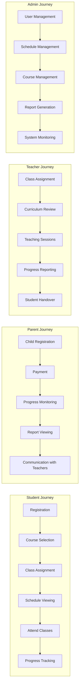

# Coding First LMS - Architecture Documentation

## Overview
Coding First adalah lembaga pelatihan programming dengan pengajar yang bekerja di perusahaan Jepang dan mengerjakan project dari Jepang. Sistem ini akan mengelola semua aspek operasional lembaga, dari manajemen siswa hingga pelaporan keuangan.

## Roles & Permissions

### 1. Orang Tua (Parent)
- Melihat report & berita acara guru tentang anaknya
- Melihat program-program yang dijual dengan harga dan benefit
- Akses link project belajar dan dokumentasi belajar anak (opsional)

### 2. Siswa (Student) 
- Melihat jadwal pribadi
- Menghubungi admin untuk ganti jadwal
- Melihat pelajaran yang tersedia di Coding First

### 3. Guru (Teacher)
- Serah terima murid ke guru lain
- Mengisi berita acara
- Melihat jadwal hari ini
- Track record mengajar bulanan
- Akses silabus/kurikulum
- Melihat materi pembelajaran
- Melihat kelas yang diajar
- Melihat jadwal seluruh guru & murid (1 bulan)

### 4. Admin
- CRUD jadwal harian & bulanan murid aktif
- Aktivasi/deaktivasi guru dan murid
- CRUD pelajaran
- Aktivasi/deaktivasi pelajaran
- Posting report bulanan ke orang tua
- Melihat keuangan masuk bulanan

### 5. Finance
- Input uang masuk harian
- Summary murid masuk harian
- Daily report keuangan dan kehadiran karyawan

### 6. Super Admin
- CRUD kelas
- CRUD kurikulum
- Akses ke semua fitur sistem

## Database Architecture

### ERD (Entity Relationship Diagram)

```mermaid
erDiagram
    USERS ||--o{ PROFILES : "has"
    USERS ||--o{ USER_ROLES : "has"
    USERS ||--o{ CLASSES : "teaches"
    USERS ||--o{ ENROLLMENTS : "enrolled_in"
    USERS ||--o{ PARENT_STUDENT : "parent_of"
    USERS ||--o{ REPORTS : "receives"
    USERS ||--o{ ATTENDANCE : "attended_by"
    USERS ||--o{ FINANCIAL_TRANSACTIONS : "paid_by"

    ROLES ||--o{ USER_ROLES : "assigned_to"
    
    COURSES ||--o{ CURRICULUMS : "has"
    COURSES ||--o{ CLASSES : "instantiated_as"
    COURSES ||--o{ ENROLLMENTS : "enrolled_for"
    
    CURRICULUMS ||--o{ SYLLABUSES : "contains"
    
    SYLLABUSES ||--o{ MATERIALS : "has"
    
    CLASSES ||--o{ SCHEDULES : "has"
    CLASSES ||--o{ ENROLLMENTS : "contains"
    CLASSES ||--o{ REPORTS : "generates"
    CLASSES ||--o{ TEACHER_HANDOVERS : "transferred_in"
    
    SCHEDULES ||--o{ ATTENDANCE : "records"
    
    ENROLLMENTS ||--o{ ATTENDANCE : "tracked_for"
    ENROLLMENTS ||--o{ REPORTS : "reported_for"
    
    USERS {
        bigint id PK
        string name
        string email
        timestamp email_verified_at
        string password
        boolean is_active
        timestamps created_at_updated_at
    }

    ROLES {
        bigint id PK
        string name "parent, student, teacher, admin, finance, superadmin"
        string guard_name
        timestamps created_at_updated_at
    }

    USER_ROLES {
        bigint model_id PK,FK
        bigint role_id PK,FK
        string model_type
    }

    PROFILES {
        bigint id PK
        bigint user_id FK
        string full_name
        text address
        string phone_number
        date birth_date
        enum gender "male,female"
        text bio
        string avatar
        timestamps created_at_updated_at
    }

    PARENT_STUDENT {
        bigint id PK
        bigint parent_id FK
        bigint student_id FK
        timestamps created_at_updated_at
    }

    COURSES {
        bigint id PK
        string name
        string slug
        text description
        decimal price "10,2"
        text benefits
        string level "beginner,intermediate,advanced"
        integer duration_weeks
        boolean is_active
        string thumbnail
        timestamps created_at_updated_at
    }

    CURRICULUMS {
        bigint id PK
        bigint course_id FK
        string title
        text description
        integer sequence_order
        boolean is_active
        timestamps created_at_updated_at
    }

    SYLLABUSES {
        bigint id PK
        bigint curriculum_id FK
        string topic
        text description
        integer sequence_order
        integer estimated_hours
        timestamps created_at_updated_at
    }

    MATERIALS {
        bigint id PK
        bigint syllabus_id FK
        string title
        text description
        enum type "document,video,link,code"
        string file_path
        string external_link
        integer sequence_order
        timestamps created_at_updated_at
    }

    CLASSES {
        bigint id PK
        bigint course_id FK
        bigint teacher_id FK
        string name
        text description
        date start_date
        date end_date
        integer max_students
        enum status "planned,active,completed,cancelled"
        timestamps created_at_updated_at
    }

    SCHEDULES {
        bigint id PK
        bigint class_id FK
        string title
        text description
        datetime start_time
        datetime end_time
        string meeting_link
        enum status "scheduled,ongoing,completed,cancelled"
        timestamps created_at_updated_at
    }

    ENROLLMENTS {
        bigint id PK
        bigint class_id FK
        bigint student_id FK
        date enrollment_date
        enum status "active,inactive,completed,dropped"
        timestamps created_at_updated_at
    }

    ATTENDANCE {
        bigint id PK
        bigint schedule_id FK
        bigint student_id FK
        boolean is_present
        text notes
        datetime check_in_time
        timestamps created_at_updated_at
    }

    REPORTS {
        bigint id PK
        bigint class_id FK
        bigint student_id FK
        bigint teacher_id FK
        string title
        text content
        text recommendations
        decimal progress_percentage "5,2"
        date report_date
        enum type "weekly,monthly,final"
        timestamps created_at_updated_at
    }

    TEACHER_HANDOVERS {
        bigint id PK
        bigint class_id FK
        bigint from_teacher_id FK
        bigint to_teacher_id FK
        date handover_date
        text reason
        text notes
        enum status "pending,approved,completed"
        timestamps created_at_updated_at
    }

    FINANCIAL_TRANSACTIONS {
        bigint id PK
        bigint student_id FK
        bigint course_id FK
        decimal amount "10,2"
        date transaction_date
        enum payment_method "cash,transfer,card,ewallet"
        string transaction_reference
        enum status "pending,paid,failed,refunded"
        text notes
        timestamps created_at_updated_at
    }

    ANNOUNCEMENTS {
        bigint id PK
        bigint created_by FK
        string title
        text content
        enum target_audience "all,parents,students,teachers,staff"
        boolean is_published
        datetime published_at
        timestamps created_at_updated_at
    }

    BOOTCAMP_BATCHES {
        bigint id PK
        bigint course_id FK
        string name
        text description
        date start_date
        date end_date
        integer max_participants
        decimal price "10,2"
        enum status "registration,ongoing,completed"
        timestamps created_at_updated_at
    }
```



### System Flow Diagram

```mermaid
flowchart TD
    A[User Login] --> B{Role Check}
    
    B -->|Parent| C[Parent Dashboard]
    B -->|Student| D[Student Dashboard]  
    B -->|Teacher| E[Teacher Dashboard]
    B -->|Admin| F[Admin Dashboard]
    B -->|Finance| G[Finance Dashboard]
    B -->|SuperAdmin| H[SuperAdmin Dashboard]
    
    C --> C1[View Child Reports]
    C --> C2[View Available Courses]
    C --> C3[View Child Progress]
    
    D --> D1[View Schedule]
    D --> D2[Request Schedule Change]
    D --> D3[View Available Courses]
    D --> D4[View Materials]
    
    E --> E1[View Today Schedule]
    E --> E2[Fill Attendance Report]
    E --> E3[Handover Students]
    E --> E4[View Teaching Load]
    E --> E5[Access Curriculum]
    
    F --> F1[Manage Users]
    F --> F2[Manage Schedules]
    F --> F3[Manage Courses]
    F --> F4[View Financial Reports]
    F --> F5[Send Reports to Parents]
    
    G --> G1[Daily Financial Input]
    G --> G2[Generate Daily Reports]
    G --> G3[Track Student Payments]
    
    H --> H1[Manage All Entities]
    H --> H2[System Configuration]
    H --> H3[Advanced Reports]
    
    I[API Layer] --> I1[Authentication API]
    I --> I2[User Management API]
    I --> I3[Course Management API]
    I --> I4[Schedule Management API]
    I --> I5[Financial API]
    I --> I6[Report API]
```



### User Journey Flow



## MVC Architecture Design

### Models Structure

```
app/Models/
├── User.php (Main user model with roles)
├── Profile.php (Extended user information)
├── Course.php (Course catalog)
├── Curriculum.php (Course curriculum)
├── Syllabus.php (Curriculum topics)
├── Material.php (Learning materials)
├── ClassName.php (Class instances)
├── Schedule.php (Class schedules)
├── Enrollment.php (Student enrollments)
├── Attendance.php (Attendance records)
├── Report.php (Progress reports)
├── TeacherHandover.php (Teacher transitions)
├── FinancialTransaction.php (Payment records)
├── Announcement.php (System announcements)
└── BootcampBatch.php (Bootcamp batches)
```

### Controllers Structure

```
app/Http/Controllers/
├── Auth/ (Laravel Breeze controllers)
├── LandingController.php (Public pages)
├── DashboardController.php (Role-based dashboards)
├── ProfileController.php (User profile management)
├── Parent/
│   ├── DashboardController.php
│   ├── ReportController.php
│   ├── CourseController.php
│   └── ChildController.php
├── Student/
│   ├── DashboardController.php
│   ├── ScheduleController.php
│   ├── CourseController.php
│   └── MaterialController.php
├── Teacher/
│   ├── DashboardController.php
│   ├── ScheduleController.php
│   ├── AttendanceController.php
│   ├── ReportController.php
│   ├── HandoverController.php
│   └── CurriculumController.php
├── Admin/
│   ├── DashboardController.php
│   ├── UserController.php
│   ├── ScheduleController.php
│   ├── CourseController.php
│   ├── ClassController.php
│   └── ReportController.php
├── Finance/
│   ├── DashboardController.php
│   ├── TransactionController.php
│   └── ReportController.php
├── SuperAdmin/
│   ├── DashboardController.php
│   ├── SystemController.php
│   ├── CurriculumController.php
│   └── AnalyticsController.php
└── Api/
    ├── AuthController.php
    ├── UserController.php
    ├── CourseController.php
    ├── ScheduleController.php
    ├── ReportController.php
    └── FinancialController.php
```

### Views Structure

```
resources/views/
├── layouts/
│   ├── app.blade.php (Main application layout)
│   ├── guest.blade.php (Guest layout for landing)
│   └── components/ (Reusable UI components)
├── landing.blade.php (Public landing page)
├── dashboard.blade.php (Main dashboard)
├── auth/ (Authentication views - Breeze)
├── profile/ (Profile management)
├── parent/
│   ├── dashboard.blade.php
│   ├── reports/
│   ├── courses/
│   └── children/
├── student/
│   ├── dashboard.blade.php
│   ├── schedule/
│   ├── courses/
│   └── materials/
├── teacher/
│   ├── dashboard.blade.php
│   ├── schedule/
│   ├── attendance/
│   ├── reports/
│   ├── handover/
│   └── curriculum/
├── admin/
│   ├── dashboard.blade.php
│   ├── users/
│   ├── schedules/
│   ├── courses/
│   ├── classes/
│   └── reports/
├── finance/
│   ├── dashboard.blade.php
│   ├── transactions/
│   └── reports/
└── superadmin/
    ├── dashboard.blade.php
    ├── system/
    ├── curriculum/
    └── analytics/
```

## API Design

### Authentication Endpoints
- `POST /api/auth/login` - User login
- `POST /api/auth/logout` - User logout  
- `POST /api/auth/refresh` - Refresh token
- `GET /api/auth/me` - Get current user

### User Management
- `GET /api/users` - List users (admin+)
- `GET /api/users/{id}` - Get user details
- `POST /api/users` - Create user (admin+)
- `PUT /api/users/{id}` - Update user (admin+)
- `DELETE /api/users/{id}` - Delete user (superadmin)

### Course Management
- `GET /api/courses` - List courses
- `GET /api/courses/{id}` - Get course details
- `POST /api/courses` - Create course (admin+)
- `PUT /api/courses/{id}` - Update course (admin+)
- `DELETE /api/courses/{id}` - Delete course (superadmin)

### Schedule Management
- `GET /api/schedules` - List schedules
- `GET /api/schedules/user/{userId}` - Get user schedules
- `POST /api/schedules` - Create schedule (admin+)
- `PUT /api/schedules/{id}` - Update schedule (admin+)
- `DELETE /api/schedules/{id}` - Delete schedule (admin+)

### Reports
- `GET /api/reports/student/{id}` - Get student reports
- `POST /api/reports` - Create report (teacher+)
- `PUT /api/reports/{id}` - Update report (teacher+)

### Financial
- `GET /api/transactions` - List transactions (finance+)
- `POST /api/transactions` - Create transaction (finance+)
- `GET /api/reports/financial` - Financial reports (finance+)

## Implementation Steps

### Phase 1: Database Setup ✅
1. ✅ Create migrations for all tables
2. ✅ Set up model relationships
3. ✅ Create seeders for initial data
4. ⏳ Set up factories for testing

### Phase 2: Authentication & Authorization ✅
1. ✅ Configure Spatie Laravel Permission
2. ⏳ Create role-based middleware
3. ✅ Set up user registration flow
4. ⏳ Implement profile management

### Phase 3: Core Functionality ⏳
1. ✅ Course management system
2. ⏳ Class and schedule management
3. ⏳ Enrollment system
4. ⏳ Attendance tracking

### Phase 4: Reporting System ⏳
1. ⏳ Progress reports
2. ⏳ Financial reports  
3. ⏳ Administrative reports
4. ⏳ Parent communication

### Phase 5: Advanced Features ⏳
1. ⏳ Teacher handover system
2. ⏳ Bootcamp management
3. ⏳ Advanced analytics
4. ⏳ System notifications

### Phase 6: API Development ⏳
1. ⏳ RESTful API endpoints
2. ⏳ API authentication (Sanctum)
3. ⏳ API documentation
4. ⏳ Rate limiting

### Phase 7: Frontend Polish ⏳
1. ✅ Responsive design with Tailwind
2. ⏳ Interactive components
3. ⏳ Performance optimization
4. ⏳ Cross-browser testing

### Phase 8: Testing & Deployment ⏳
1. ⏳ Unit tests
2. ⏳ Feature tests
3. ⏳ Performance testing
4. ⏳ Production deployment

## Security Considerations

1. **Authentication**: Laravel Breeze + Sanctum for API
2. **Authorization**: Spatie Laravel Permission for role-based access
3. **Data Validation**: Form requests with comprehensive validation
4. **CSRF Protection**: Built-in Laravel CSRF protection
5. **SQL Injection**: Eloquent ORM prevents SQL injection
6. **XSS Protection**: Blade template escaping
7. **Rate Limiting**: API rate limiting for external access
8. **Data Encryption**: Sensitive data encryption at rest

## Performance Optimization

1. **Database Indexing**: Proper indexing on frequently queried columns
2. **Query Optimization**: Eager loading relationships
3. **Caching**: Redis/Memcached for session and query caching  
4. **Asset Optimization**: Vite for asset bundling and optimization
5. **CDN**: Static asset delivery via CDN
6. **Database Connection Pooling**: Efficient database connections

## Scalability Considerations

1. **Horizontal Scaling**: Load balancer support
2. **Database Replication**: Master-slave database setup
3. **Queue System**: Background job processing
4. **Microservices Ready**: API-first architecture for future separation
5. **Containerization**: Docker support for deployment flexibility

## Current Status

✅ **Completed:**
- Database architecture and migrations
- User authentication and role system
- Course management
- Landing page with responsive design
- Basic dashboards for all roles

⏳ **In Progress:**
- Complete CRUD operations for all entities
- Advanced reporting system
- Real-time notifications
- API endpoints

🔜 **Next Steps:**
- Complete teacher and admin dashboards
- Implement schedule management
- Build financial tracking system
- Add real-time features

This architecture provides a solid foundation for building a comprehensive Learning Management System that can scale with the growth of Coding First institution. 